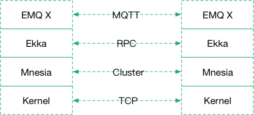

.. EMQ X 连接平台白皮书 documentation master file, created by
   sphinx-quickstart on Sun Sep 10 19:34:45 2017.
   You can adapt this file completely to your liking, but it should at least
   contain the root `toctree` directive.

====================
EMQ X 连接平台白皮书
====================

[版权申明]

©2013-2017 EMQ 公司版权所有。

本文档著作权归 EMQ 公司所有，未经 EMQ 事先书面或邮件许可，任何主体不得以任何形式复制、修改、传播全部或部分本文档内容

[服务申明]

本文档主要用于介绍 EMQ 产品和服务当时的概况，部分产品和服务可能有所调整，不直接作为商业合同约定。

[关键字]

EMQ、MQTT、CoAP、NB-IoT、LoRa、物联网平台

平台概述
========

EMQ X 是开放源码架构的电信级物联网连接平台，用于企业物联网应用中终端硬件同应用系统的互联与解耦，为万物互联提供可靠安全的终端接入、协议适配、消息路由、数据桥接、数据存储及通用设备管理等一站式服务。

EMQ X 连接平台可应用于物联⽹、车联网、工业物联网、智能家居、移动消息等跨行业领域，并支持以公有云、私有云、物理机及Docker容器方式进行灵活部署。

.. image:: ./_static/images/emqxiot.png

平台特点
========

1. 开放源码架构，基于开放标准协议设计，广泛的社区生态支持，丰富的设备SDK与应用使能API，支持客户灵活定制开发，快速市场交付物联网应用。

2. 物理传输网络透明，适配所有电信级和企业级网络，包括传统无线网络2G/3G/4G/WIFI，有线网络PON、LAN，以及物联网专用的低功耗广域网NB-IoT、eMTC和LoRa；

3. 多协议适配适配，支持接入运行物联网主流协议的各类模组与终端，包括MQTT、CoAP、WebSocket、HTTP、MQTT-SN、LWM2M、LoRaWAN、Storm等协议类型，同时支持对行业协议与私有协议的定制适配与在线热加载；

4. 数据全面持久化，平台接入的各类信息根据数据类型通过Backend高速存储至主流数据库，也能够通过微服务桥接转发数据到Kafka或其他企业消息服务器；

5. 多重安全与认证机制，传输层TLS、DTLS安全连接，X509证书、OAuth2、JWT Token 与用户名密码认证，全面保护物联网网络与企业数据安全。

6. 电信级分布式架构，高可靠高可用集群，具备水平弹性扩展能力，单机可承载百万级并发接入，单集群可承载千万级接入容量；

7. 在线热升级热扩容，系统采用模块化和插件化设计，可不中断系统运行，实现平台升级和功能模块扩展；

8. 灵活的部署安装，支持在企业私有云、公有云、混合云、物理机、Docker容器一键部署。

平台架构
========

EMQ X 千万级高并发物联网连接平台，构建大型物联网应用最佳平台实践，支持公有云私有云容器云混合部署:

.. image:: ./_static/images/emqxarch.png

EMQ X 平台改进了节点间的通信机制，分离 Erlang 自身的集群通道与 EMQ 的数据通道，大幅提高集群的消息吞吐与集群稳定性:

平台功能
========

设备连接
--------

EMQ X 平台支持千万级规模的设备云端接入与 M2M 通信，支持近百款主流芯片、模组、设备、网关，2G/3G/4G/Wifi移动网络支持，与LoRaWan/NB-IoT低功耗网络终端接入。

协议适配
--------

EMQ X 平台完整支持MQTT、CoAP物联网两大标准协议，扩展支持MQTT-SN、WebSocket、HTTP标准协议，LWM2M、LoRaWAN低功耗网络协议，以及工业ModeBus协议，同时支持现网设备私有 TCP/UDP 协议适配。

EMQ X 平台完整实现的OASIS MQTT3.1/3.1.1协议规范，严格处理QOS0、QOS1及工业级QOS2消息，支持持久会话、离线消息和LastWill消息，同时针对物联网应用扩展了两类订阅模式，包括为省电设计的代理订阅和对消费侧进行负载均衡的共享订阅。

安全认证
--------

EMQ X 平台支持传输层TLS、DTLS安全连接，LB 终结 SSL，X509证书、OAuth2、JWT Token 与用户名密码认证，支持接入LDAP、HTTP、MySQL、Redis 认证系统，支持基于Topic发布订阅模式，细粒度访问权限控制。

消息路由
--------

EMQ X 平台支持双向实时发布订阅消息，亿级基于Topic的动态路由表，多节点集群消息路由与负载均衡消息派发，支持低延时高可靠工业级QOS消息。

数据桥接
--------

EMQ X 平台支持微服务架构的数据桥接，MQTT、CoAP 数据汇聚桥接 Kafka 或 RabbitMQ，设备连接、订阅关系、状态事件转发 Kafka，MQTT 共享订阅方式桥接 DataHub 服务。

数据存储
--------

EMQ X 平台支持数据多种方式持久化，MQTT、CoAP 消息数据、订阅关系、设备状态及状态变更等信息，可通过过Hook/Action机制存储至多种类型数据库，支持按主题规则同时写入多个库表或多个不同数据库:

* Redis
* MySQL
* PostgreSQL
* MongoDB
* Cassandra

设备管理
--------

EMQ X 平台支持设备连接管理，通过 API 查询或数据库存储，设备状态与变更事件；支持设备代理订阅，云端代理客户端进行订阅，大幅减少设备与云端交互。

EMQ X 平台支持设备开通管理，设备认证鉴权，X509证书或ClientID设备身份管理； 支持设备状态控制，设备影子、设备OTA升级与生命周期管理。

应用使能
--------

EMQ X 平台支持四大 API 接口灵活使能物联网应用开发：

1. REST API 接口，查询与管理设备连接

2. PubSub API 接口，微服务 DataHub

3. Stream API 接口，数据流转与处理

4. Web Hook 接口，调用外部应用服务

应用场景
========

通用物联网云平台
----------------

EMQ X 平台提供物联网应用运行所需的安全、连接、存储等完整云端服务，基于 MQTT、CoAP 连接海量设备、消息、数据、应用，实现跨行业、跨网络的端到端万物互联，助力企业以天粒度快速开发与交付行业应用。

工业物联网平台
--------------

EMQ X 平台针对新型工业4.0建设以及传统工业的旧网改造，提供工业多协议接入、双向实时数据流式处理、海量信息高速存储等全栈服务，毫秒级数据时延与高可靠 QOS 保障工业网络全面信息化和智能化，实现企业的高效运营与价值创新。

LoraWan 网络云平台
------------------

EMQ X 平台为企业级低功耗广域网（LoRa）提供平台支撑，完全遵循标准 LoRaWAN 规范，实现 LoRa 网络数据流向中涉及的节点接入鉴权、网关接入控制、LoRaMAC 协议解析、消息路由与数据存储等各层次功能，支持多厂家、多网关组网场景，已成为企业自建与运营 LPWAN 必不可少的基础设施。

物联网行业应用
--------------

EMQ X 平台广泛用于消费电子、智能家居、工业制造、共享经济、智慧城市、智慧停车、智慧农业、能源电力等行业的物联网业务创新。

性能测试
========

EMQ X 平台性能测试由第三方测试公司 XMeter（北京臻云科技有限责任公司）提供，主要测试 EMQ X 平台的并发连接、消息吞吐、消息时延等指标。

测试报告下载: https://media.readthedocs.org/pdf/emq-xmeter-benchmark-cn/latest/emq-xmeter-benchmark-cn.pdf

联系我们
========

公司: 杭州映云科技有限公司 

官网: http://www.emqtt.com 

电话: 400-696-5502 

邮箱: contact@emqtt.io 

微信: emqttd 

微博: http://weibo.com/emqtt 

Twitter: @emqtt

