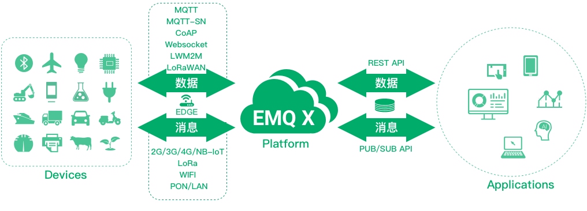
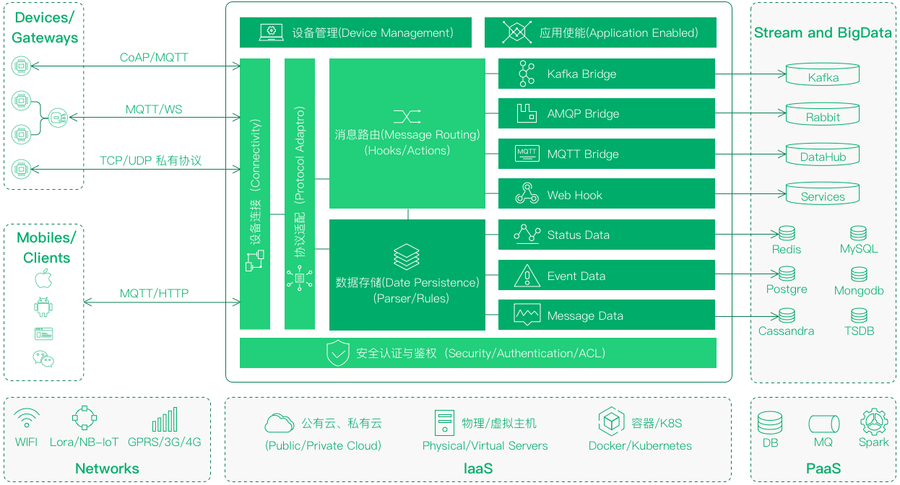

.. EMQ X 连接平台白皮书 documentation master file, created by
   sphinx-quickstart on Sun Sep 10 19:34:45 2017.
   You can adapt this file completely to your liking, but it should at least
   contain the root `toctree` directive.

====================
EMQ X 连接平台白皮书
====================

[版权申明]

©2013-2017 EMQ 公司版权所有。

本文档著作权归 EMQ 公司单独所有，未经 EMQ 事先书面或邮件许可，任何主体不得以任何形式复制、修改、传播全部或部分本文档内容

[服务申明]

本文档主要用于介绍 EMQ 产品和服务当时的概况，部分产品和服务可能有所调整，不直接作为商业合同约定。

[关键字]

EMQ、MQTT、CoAP、物联网云平台、并发连接、NB-IoT、LoRa

平台概述
========

EMQ X 电信级物联网连接平台，用于企业物联网应用中终端硬件同应用系统的互联与解耦，为万物互联提供可靠安全的终端接入、协议适配、消息路由、数据存储及通用设备管理等一站式服务。

EMQ X 属于通用连接平台，可应用于物联⽹、车联网、工业物联网、智能家居、移动消息等跨行业领域，并能够灵活部署于公有云、私有云、物理机、Docker等多类场景。

平台特点
========

1. 对物理传输网络透明，适配所有电信级和企业级网络，包括传统无线网络2G、3G、4G、WIFI，有线网络PON、LAN，以及物联网专用的低功耗广域网NB-IoT、eMTC和LoRa；

2. 电信级分布式架构，具备水平扩展能力，单机可承载百万级并发接入，单集群可承载千万级接入容量；

3. 多协议适配适配，能够接入运行物联网主流协议的各类模组与终端，包括MQTT、CoAP、WebSocket、HTTP、MQTT-SN、LWM2M、LoRaWAN、Storm等协议类型，同时支持对行业协议与私有协议的定制适配与在线热加载；

4. 数据全面持久化，平台接入的各类信息根据数据类型通过Backend高速存储至主流数据库，也能够通过微服务直接桥接到外部消息队列；

5. 在线热升级热扩容，系统采用模块化和插件化设计，可不中断系统运行，实现平台升级和功能模块扩展。

6. 灵活的运行环境，企业私有云、公有云、物理机、Docker均能一键部署；

7. 多重安全与认证机制，全面保护物联网网络与企业信息的安全。

平台架构
========

EMQ X 千万级高并发物联网连接平台，构建大型物联网应用最佳平台实践，支持公有云私有云容器云混合部署:

平台功能
========

设备连接
--------

千万级设备云端接入与 M2M 通信

百款芯片、模组、设备、网关支持

2G/3G/4G/Wifi移动网络支持

LoRaWan/NB-IoT低功耗网络支持

协议适配
--------

完整支持MQTT、CoAP物联网两大标准协议

扩展支持MQTT-SN、WebSocket标准协议

LWM2M、LoRaWan 低功耗网络协议支持

现网设备与企业私有 TCP/UDP 协议适配

EMQ X适配的协议包括MQTT、CoAP(RFC7252)、MQTT-SN、Stomp/SockJS、WebSocket、HTTP、LWM2M、ModBus、LoRaWAN等。EMQ X遵循完整的OASIS MQTT3.1/3.1.1协议规范，严格处理QOS0、QOS1及工业级QOS2消息，支持持久会话、离线消息和LastWill消息，同时针对物联网应用扩展了两类订阅模式，包括为省电设计的本地订阅和对消费侧进行负载均衡的共享订阅。

安全认证
--------

传输层TLS、DTLS安全连接，LB 终结 SSL 支持

X509证书、OAuth2、JWT Token 与用户名密码认证

支持接入LDAP、HTTP、MySQL、Redis 认证系统

基于Topic发布订阅模式，细粒度访问权限控制

消息路由
--------

双向实时发布订阅消息、亿级动态路由表支持，多节点集群与负载消费支持，低延时高可靠消息工业级QOS

数据桥接
--------

MQTT、CoAP 数据汇聚桥接 Kafka 或 RabbitMQ

设备连接、订阅关系、消息确认事件转发 Kafka

MQTT 共享订阅方式桥接转发数据到 DataHub

EMQ 通过 Kafka 汇聚数据流入 Spark、Hadoop

数据存储
--------

MQTT、CoAP 消息数据、订阅关系、设备状态及状态变更等信息，可通过过Hook/Action机制存储至多种类型数据库，支持按主题规则写入多个库表或多个不同数据库:

* Redis
* MySQL
* PostgreSQL
* MongoDB
* Cassandra

设备管理
--------

设备连接管理，通过 API 查询或数据库存储，设备状态与变更事件

设备代理订阅，云端代理客户端进行订阅，大幅减少设备与云端交互

设备开通管理，设备认证鉴权，X509证书或ClientID设备身份管理

设备状态控制，设备影子、设备OTA升级与生命周期管理

应用使能
--------

四大 API 接口灵活使能物联网应用开发：

1. REST API 接口，查询与管理设备连接

2. PubSub API 接口，微服务 DataHub

3. Stream API 接口，数据流转与处理

4. Web Hook 接口，调用外部应用服务

安装部署
========

公有云

私有云

物理主机

容器

EMQ X 支持以公有云、私有云、物理机及Docker方式进行部署，可运行的云端操作系统包含CentOS、Ubuntu、Debian、Mac OS等。

性能测试
========

EMQ X 连接平台的性能测试由第三方测试公司 XMeter（北京臻云科技有限责任公司）提供，主要测试EMQ X平台的并发连接、消息吞吐、消息时延等指标。

测试报告下载: https://media.readthedocs.org/pdf/emq-xmeter-benchmark-cn/latest/emq-xmeter-benchmark-cn.pdf

应用场景
========

通用物联网云平台
----------------

EMQ 提供物联网应用运行所需的安全、连接、存储等完整云端服务，基于 MQTT、CoAP 连接海量设备、消息、数据、应用，实现跨行业、跨网络的端到端万物互联，助力企业以天粒度快速开发与交付行业应用。

工业物联网平台
----------------

EMQ 针对新型工业4.0建设以及传统工业的旧网改造，提供工业多协议接入、双向实时数据流式处理、海量信息高速存储等全栈服务，毫秒级数据时延与高可靠 QOS 保障工业网络全面信息化和智能化，实现企业的高效运营与价值创新。

LoraWan 网络云平台
------------------

EMQ 为企业级低功耗广域网（LoRa）提供平台支撑，完全遵循标准 LoRaWAN 规范，实现 LoRa 网络数据流向中涉及的节点接入鉴权、网关接入控制、LoRaMAC 协议解析、消息路由与数据存储等各层次功能，支持多厂家、多网关组网场景，已成为企业自建与运营 LPWAN 必不可少的基础设施。

联系我们
========

公司: 杭州映云科技有限公司 

官网: http://www.emqtt.com 

电话: 400-696-5502 

邮箱: contact@emqtt.io 

微信: emqttd 

微博: http://weibo.com/emqtt 

Twitter: @emqtt

资料来源
========

1. EMQ @ QingCloud Insight PPT

2. EMQ 青云开发大规模物联网实践

3. EMQ 官网页面

4. EMQ 原网站页面

5. EMQ 产品文档

